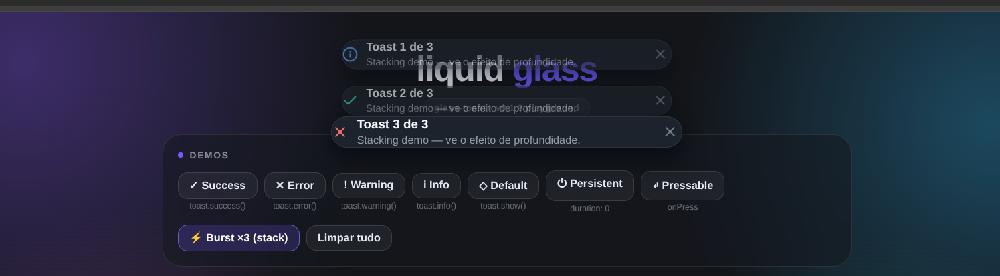

# Glass Toast

A lightweight, cross-platform toast notification library for **React Native** and **Web** — opaque pastel pill toasts with circular icon badges, action buttons (`GOT IT`), animated icons, light/dark themes and deep customization (sizes, fonts, animations, layout).



[](https://www.npmjs.com/package/glass-toast)
[](https://www.npmjs.com/package/glass-toast)
[](LICENSE.md)

## Status

```text
v0.2.0
```

The API may change before the first stable release.

## Highlights

- **Pastel pill design** — fully rounded, opaque pastel surfaces with a circular icon badge and soft depth shadows, in light and dark themes.
- **Action buttons** — `action: { label, onPress }` renders a call-to-action pill (`GOT IT`) that replaces the close button.
- **Animation presets** — `spring`, `bounce`, `slide` or `fade` enter/exit styles, provider- or toast-level.
- **Light / dark / system theme** — follows the OS appearance live (`prefers-color-scheme` on web, `Appearance` on native) or can be forced.
- **Animated icons** — lucide glyphs (`Check`, `X`, `AlertTriangle`, `Info`, `Bell`) with spring pop + fade/rise intro beats, driven by Reanimated. Custom icons via the `icon` option; `iconBadge` styles: `solid`, `soft`, `bare`.
- **4 variants** — `toast`, `notification`, `popover` and `glass` (opt-in liquid glass with `blur`).
- **3 sizes** — `sm`, `md`, `lg`.
- **6 positions** — `top`, `top-left`, `top-right`, `bottom`, `bottom-left`, `bottom-right`.
- **Smart stacking** — collapsed stack with peek (`stack`) or plain list (`list`), with tight/normal/loose gaps.
- **Imperative API** — `toast.success(...)` works inside or outside the React tree.
- TypeScript-first, zero runtime dependencies, ~35 kB minified (ESM).

## Installation

```bash
npm install glass-toast
```

Peer dependencies: `react >= 18`, `react-native >= 0.74`, `react-native-reanimated >= 3.17` (`react-dom` and `react-native-svg` optional, for web portals and the built-in icons).

> On the web, alias `react-native` → `react-native-web` in your bundler and define the globals `__DEV__` and `global` (Metro usually provides them; Vite example below).

## Usage

Wrap your application with `ToastProvider`:

```tsx
import { ToastProvider } from "glass-toast";

export function App() {
  return (
    <ToastProvider>
      <YourApplication />
    </ToastProvider>
  );
}
```

Then call the toast API:

```tsx
import { toast } from "glass-toast";

toast.success("Account created successfully.");
```

### Toast Types

```tsx
toast.success("Operation completed.");
toast.error("Something went wrong.");
toast.warning("Please check your information.");
toast.info("A new update is available.");
toast.show({ title: "Syncing…", description: "No type icon accent." });
```

## API

### `toast.show(options)`

Creates a toast with custom options and returns its `id`.

```tsx
toast.show({
  title: "Payment",
  description: "Your payment was completed successfully.",
  type: "success",
});
```

### `toast.success / error / warning / info(title, options?)`

Typed shortcuts that preset the icon and accent color.

```tsx
toast.success("Successfully saved.");
```

### `toast.dismiss(id)`

Dismisses a specific toast (plays the exit animation).

```tsx
const id = toast.info("Working…");
toast.dismiss(id);
```

### `toast.dismissAll()`

Dismisses all active toasts.

```tsx
toast.dismissAll();
```

## Toast Options

| Option               | Type                                      | Description                                        |
| -------------------- | ----------------------------------------- | -------------------------------------------------- |
| `id`                 | `string`                                  | Custom toast identifier (re-showing an id fronts it) |
| `title`              | `string`                                  | Toast title                                        |
| `description`        | `string`                                  | Additional information                             |
| `type`               | `'default' \| 'success' \| 'error' \| 'warning' \| 'info'` | Icon and accent color            |
| `duration`           | `number`                                  | ms before auto-dismiss (`0` = persistent)          |
| `position`           | `'top' \| 'top-left' \| 'top-right' \| 'bottom' \| 'bottom-left' \| 'bottom-right'` | Screen corner |
| `dismissible`        | `boolean`                                 | Whether the user can dismiss it                    |
| `onPress`            | `() => void`                              | Called when the toast body is pressed              |
| `onDismiss`          | `() => void`                              | Called after dismissal, for any reason             |
| `variant`            | `'toast' \| 'notification' \| 'popover' \| 'glass'` | Visual variant (`glass` = liquid glass material)  |
| `size`               | `'sm' \| 'md' \| 'lg'`                    | Size preset                                        |
| `action`             | `{ label: string; onPress: () => void }`  | Call-to-action button (e.g. `GOT IT`); replaces the close button and dismisses the toast after the callback |
| `animation`          | `'spring' \| 'bounce' \| 'slide' \| 'fade'` | Enter/exit animation style                        |
| `borderRadius`       | `number`                                  | Corner radius override (`0` = variant default)     |
| `width`              | `'full' \| 'hug'`                         | Fill the max width or hug the content              |
| `fontFamily`         | `string`                                  | Font family for title, description and action      |
| `iconBadge`          | `'solid' \| 'soft' \| 'bare'`             | Leading icon badge style                           |
| `icon`               | `ComponentType<ToastIconProps>`           | Custom icon component                              |
| `accessibilityLive`  | `'polite' \| 'assertive' \| 'off'`        | Screen reader announcement                         |

## Positions

```text
top   top-left   top-right
bottom   bottom-left   bottom-right
```

```tsx
toast.success("Saved successfully.", { position: "bottom-right" });
```

## Provider Configuration

```tsx
<ToastProvider
  position="top-right"
  duration={4000}
  maxToasts={5}
  variant="notification"
  size="md"
  theme="system"        // 'system' | 'light' | 'dark'
  animation="spring"    // 'spring' | 'bounce' | 'slide' | 'fade'
  width="full"          // 'full' | 'hug' (content-width pill)
  iconBadge="solid"     // 'solid' | 'soft' | 'bare'
  fontFamily={undefined}// custom font family for texts
  borderRadius={0}      // corner radius override (0 = variant default)
  stackMode="stack"     // 'stack' | 'list'
  stackGap="normal"     // 'tight' | 'normal' | 'loose'
  inset={12}            // distance from screen edges
  blur={0}              // glass blur radius (web); 0 = opaque (default)
  animatedIcon
  portal                // render through a portal on web
  onToastDismiss={(t) => console.log('dismissed', t.id)}
>
  <App />
</ToastProvider>
```

Per-toast options override provider defaults.

## Liquid Glass & Depth

By default every variant renders as an **opaque pastel surface**. The `glass` variant keeps a soft pastel tint and a sheen overlay — pass `blur={20}` (or any value > 0) on web to restore the translucent `backdrop-filter: blur()` liquid-glass effect.

### Actions

```tsx
toast.show({
  title: "Hit / to explore Experts",
  type: "info",
  duration: 0,
  action: { label: "GOT IT", onPress: () => console.log("dismissed") },
});
```

Stacked toasts add physical depth: toasts behind the active one **slide under it, scale down and fade**, leaving a 10 px peek visible — the iOS-style collapsed stack. Choose `stackGap` (`tight` / `normal` / `loose`) to control spacing and `stackMode="list"` for a plain vertical list.

On native, the same token palette and layered shadows apply; the backdrop blur degrades gracefully to the translucent tint (you can wrap your own blur view later without API changes).

## Hooks

- `useToast()` — the toast API from context (same as the standalone `toast`).
- `useToastTheme(preference)` — resolves `'system' | 'light' | 'dark'` into the active glass tokens (`GLASS_TOKENS` is also exported for custom surfaces).

## Cross-platform

Glass Toast is designed to provide a consistent API across:

- **Web** (via `react-native-web`)
- **Android**
- **iOS**

## Development

```bash
git clone https://github.com/MarioEstima/glass-toast.git
cd glass-toast
npm install
npm run dev          # playground on http://localhost:5173
npm run typecheck    # tsc -b
npm run lint
npm run build        # library build (tsup: dist/)
npm run build:web    # playground build (dist-playground/)
npm run pack:check   # npm pack --dry-run
```

## Contributing

Contributions are welcome. Before contributing, please read the [Contributing Guide](CONTRIBUTING.md).

## License

Glass Toast is open source software licensed under the MIT License. See [LICENSE.md](LICENSE.md) for details.
